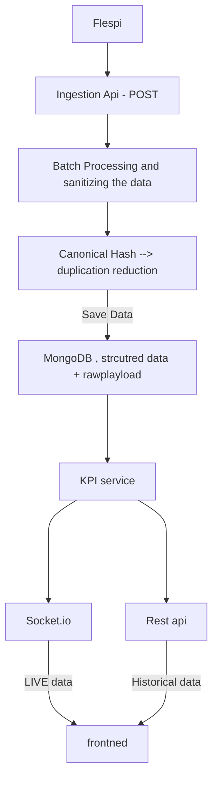

# Telemetry - Backend

## 1. Architecture

## 2. Telemetry Handling
   - Batches
   - Duplicates
   - Missing/null fields
   - Unknown fields
   - position.valid

## 3. Database Choice

## 4. KPI Calculation Decisions
   - Average Speed
   - Distance
   - Fuel Used
   - GPS Track

## Architecture

## Telemetry handling
  - Batches:- As the data is in format of the array, that may have duplicates or null value data.
  - Duplicate:-  for handling the duplication i have created an canonical stable message information such as the vehicle identifier, timestamp, and canonicalized payload, beacuse it will serve two purpose, first removing the duplication of the data, and will help in faster lookup after making the it as index.
  - missing and null fields:- Its considered as normal, hence Fields required for KPI calculations are handled properly, and missing/null values are ignored where appropriate instead of causing the ingestion process or KPI calculation to fail.
  - unknown feilds:- The Flespi payload can contain parameters that are not known to the application at development time.
  The MongoDB/Mongoose schema is configured to allow additional fields where appropriate (strict: false), so newly introduced telemetry parameters do not cause the message to be rejected
  - position.valid:- this feild determines whether the longitude and latitiude should be valid or not.
  if true then include it and if not then not needed for tracking it.

## 3. Database Choice
 - MongoDB:-  lespi is semi-structured telemetry, where the field set can vary and new parameters can appear over time and mongoDb is best for that.

## 4. KPI Calculation Decisions
  - Average Speed:- there was speed parameter in the payload, for certain time period i have done the avegerage od all valid data points.
    
    average speed = (sum of speed data)/ (total time from first data point to last) 
    
    *for selected time range only eg: 15min. 
  - Distance:- vehicle.mileage is treated as a cumulative distance/odometer reading representing the total distance covered by the vehicle 
   *For a selected time range, distance travelled is calculated as the difference between the ending and starting valid mileage readings:

    Distance = Ending Mileage - Starting Mileage
    
    The calculation requires at least two appropriate valid mileage readings, the starting and ending values

  - Fuel Used:-
   engine.total.fuel.used is treated as a cumulative fuel-consumption counter rather than the amount of fuel consumed in an individual telemetry message. 
   For a selected time range, fuel consumed is calculated as:

    Fuel Used = Ending Fuel Counter - Starting Fuel Counter
  - GPS Track:- The GPS track is derived from position.latitude and position.longitude.
   there is case if position.valid= true, are the point that are included for gps track. while if false that point where the last location of thedevice hence,that data is only stored in Db.

   live url:- https://telemetry-frontend-seven.vercel.app/
